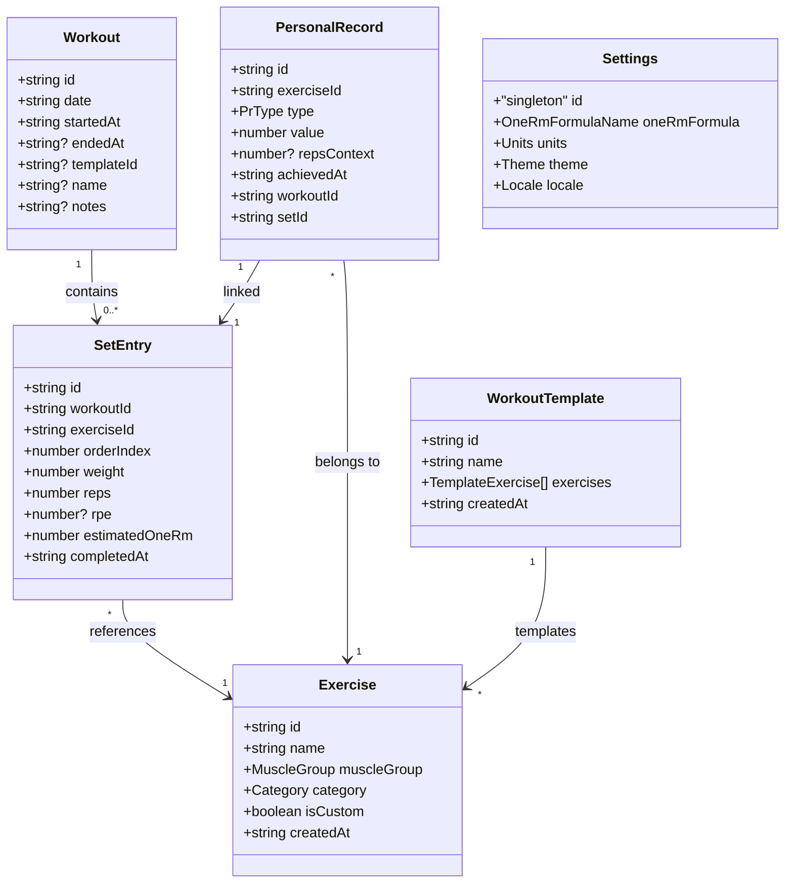

# Class diagram — doménová vrstva

```mermaid
classDiagram
    class Exercise {
      +string id
      +string name
      +MuscleGroup muscleGroup
      +Category category
      +boolean isCustom
      +string createdAt
    }

    class Workout {
      +string id
      +string date
      +string startedAt
      +string? endedAt
      +string? templateId
      +string? name
      +string? notes
    }

    class SetEntry {
      +string id
      +string workoutId
      +string exerciseId
      +number orderIndex
      +number weight
      +number reps
      +number? rpe
      +number estimatedOneRm
      +string completedAt
    }

    class PersonalRecord {
      +string id
      +string exerciseId
      +PrType type
      +number value
      +number? repsContext
      +string achievedAt
      +string workoutId
      +string setId
    }

    class WorkoutTemplate {
      +string id
      +string name
      +TemplateExercise[] exercises
      +string createdAt
    }

    class Settings {
      +"singleton" id
      +OneRmFormulaName oneRmFormula
      +Units units
      +Theme theme
      +Locale locale
    }

    Workout "1" --> "0..*" SetEntry : contains
    SetEntry "*" --> "1" Exercise : references
    PersonalRecord "*" --> "1" Exercise : belongs to
    PersonalRecord "1" --> "1" SetEntry : linked
    WorkoutTemplate "1" --> "*" Exercise : templates
```
