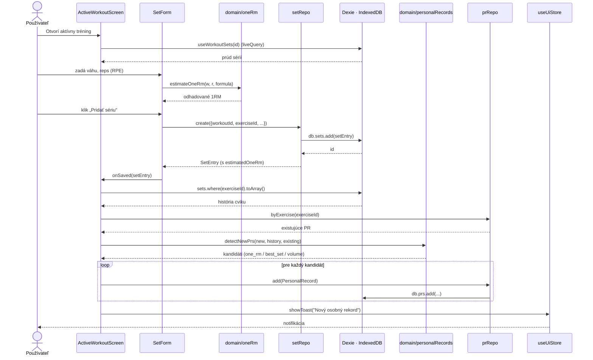

# Sequence diagram — zápis série s detekciou PR

```mermaid
sequenceDiagram
    actor U as Používateľ
    participant UI as ActiveWorkoutScreen
    participant SF as SetForm
    participant OR as domain/oneRm
    participant SR as setRepo
    participant DB as Dexie · IndexedDB
    participant PR as domain/personalRecords
    participant PRR as prRepo
    participant Toast as useUiStore

    U->>UI: Otvorí aktívny tréning
    UI->>DB: useWorkoutSets(id) (liveQuery)
    DB-->>UI: prúd sérií
    U->>SF: zadá váhu, reps (RPE)
    SF->>OR: estimateOneRm(w, r, formula)
    OR-->>SF: odhadované 1RM
    U->>SF: klik „Pridať sériu"
    SF->>SR: create({workoutId, exerciseId, ...})
    SR->>DB: db.sets.add(setEntry)
    DB-->>SR: id
    SR-->>SF: SetEntry (s estimatedOneRm)
    SF->>UI: onSaved(setEntry)
    UI->>DB: sets.where(exerciseId).toArray()
    DB-->>UI: história cviku
    UI->>PRR: byExercise(exerciseId)
    PRR-->>UI: existujúce PR
    UI->>PR: detectNewPrs(new, history, existing)
    PR-->>UI: kandidáti (one_rm / best_set / volume)
    loop pre každý kandidát
      UI->>PRR: add(PersonalRecord)
      PRR->>DB: db.prs.add(...)
    end
    UI->>Toast: showToast("Nový osobný rekord")
    Toast-->>U: notifikácia
```
