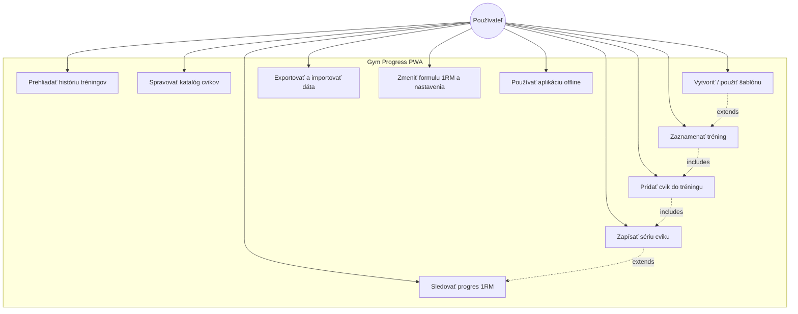

# Use-case diagram — Gym Progress

```mermaid
flowchart TB
    U((Používateľ))

    subgraph Gym_Progress[Gym Progress PWA]
      UC1[Zaznamenať tréning]
      UC2[Pridať cvik do tréningu]
      UC3[Zapísať sériu cviku]
      UC4[Sledovať progres 1RM]
      UC5[Prehliadať históriu tréningov]
      UC6[Spravovať katalóg cvikov]
      UC7[Vytvoriť / použiť šablónu]
      UC8[Exportovať a importovať dáta]
      UC9[Zmeniť formulu 1RM a nastavenia]
      UC10[Používať aplikáciu offline]
    end

    U --> UC1
    U --> UC2
    U --> UC3
    U --> UC4
    U --> UC5
    U --> UC6
    U --> UC7
    U --> UC8
    U --> UC9
    U --> UC10

    UC1 -. includes .-> UC2
    UC2 -. includes .-> UC3
    UC3 -. extends .-> UC4
    UC7 -. extends .-> UC1
```
